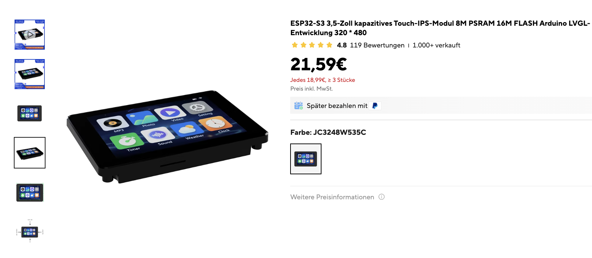

# Guition JC3248W535C_I_Y Demo



PlatformIO-Projekt fuer das Guition JC3248W535C_I_Y Board (ESP32-S3, 3.5" 320x480, Capacitive Touch, 8M PSRAM, 16M Flash) mit LVGL 9.2.2 und [Arduino_GFX](https://github.com/moononournation/Arduino_GFX) als Display-Treiber.

## Board-Specs

| Eigenschaft | Wert |
|-------------|------|
| SoC | ESP32-S3 |
| Display | 3.5" IPS, 320x480 (nativ Portrait) |
| Display-Controller | AXS15231B (QSPI) |
| Touch | AXS15231B integriert (I2C, Adresse 0x3B) |
| PSRAM | 8MB (OPI) |
| Flash | 16MB |
| Orientierung | Landscape (480x320) via Canvas-Rotation |

## Projektstruktur

```
guition-JC3248W535C_I_Y-demo/
├── include/
│   └── lv_conf.h          # LVGL Konfigurationsdatei
├── src/
│   └── main.cpp           # Hauptprogramm mit 6 Showcase-Screens
├── backup-initial-demo/   # Firmware-Backup vom Werkszustand
├── pre_build.py           # Pre-Build-Script (entfernt ARM-Assembly)
├── platformio.ini         # PlatformIO Projektkonfiguration
├── .gitignore
└── README.md
```

## Warum nicht esp32-smartdisplay?

Das andere Template (ESP32-4848S040CI) nutzt die [esp32-smartdisplay](https://github.com/rzeldent/esp32-smartdisplay) Library. Fuer dieses Board funktioniert das **nicht**, weil:

- Der AXS15231B Display-Controller nutzt **QSPI** (Quad-SPI)
- Die esp32-smartdisplay Library hat im QSPI-Treiber `SPI_MODE0` statt `SPI_MODE3` und kommentiert selbst: *"QSPI not yet supported"*
- Das Ergebnis ist ein **Bildrauschen, das langsam ausfadet**

**Loesung**: Stattdessen wird die [Arduino_GFX Library](https://github.com/moononournation/Arduino_GFX) v1.6.0 verwendet, die den AXS15231B ueber QSPI korrekt ansteuert.

## Display-Architektur

### QSPI-Bus + Canvas

Das Display wird ueber eine dreischichtige Architektur angesteuert:

```cpp
Arduino_ESP32QSPI *bus  // QSPI-Bus (CS=45, SCK=47, D0=21, D1=48, D2=40, D3=39)
Arduino_AXS15231B *g    // Display-Controller (320x480 nativ)
Arduino_Canvas *gfx     // Framebuffer-Wrapper (erforderlich fuer QSPI!)
```

**Warum Canvas?** Ohne Canvas zeigt das QSPI-Display nur einen schmalen Streifen. Der QSPI-Bus erfordert den Canvas-Layer fuer korrekte Datenuebertragung. Der Canvas allokiert einen ~307KB Framebuffer — deshalb ist **PSRAM zwingend erforderlich**.

### Landscape-Rotation

Das Display ist nativ 320x480 (Portrait). Fuer Landscape (480x320):

- **Canvas-Rotation**: `gfx->setRotation(1)` — einzige funktionierende Methode
- **Hardware-Rotation** (AXS15231B rotation Parameter): Zeigt nur einen Pixelstreifen — QSPI unterstuetzt das nicht
- **LVGL Software-Rotation**: Zeigt 2/3 des Bildschirms falsch — nicht kompatibel mit Canvas

### Touch-Koordinaten

Der AXS15231B ist ein Single-Chip fuer Display UND Touch. Touch wird ueber I2C gelesen (SDA=4, SCL=8, Addr=0x3B). Da Canvas die Rotation handhabt, muessen Touch-Koordinaten manuell rotiert werden:

```cpp
// Portrait-Koordinaten (tx, ty) → Landscape (x, y)
data->point.x = ty;
data->point.y = 319 - tx;
```

Andere Mappings die getestet wurden und NICHT funktionieren:
- `x = 479 - ty, y = tx` → invertiert
- LVGL `lv_indev_set_rotation()` → nicht kompatibel mit Canvas-Rotation

## Performance-Optimierungen

### Flush-on-Last

Ohne Optimierung wird der gesamte 307KB Canvas-Framebuffer bei **jedem** LVGL-Teilupdate ueber QSPI uebertragen — extrem langsam. Die Loesung:

```cpp
if (lv_display_flush_is_last(disp)) {
    gfx->flush();  // Nur einmal pro Frame statt bei jedem Teilupdate
}
```

### PSRAM-Nutzung

Grosse Allokationen liegen in PSRAM statt internem RAM:

- **Draw-Buffer**: 2x 153.600 Bytes in PSRAM (`ps_malloc`) statt statisch in internem RAM
- **Double Buffering**: LVGL rendert in Buffer A waehrend Buffer B zum Display geht
- **LVGL malloc**: `LV_USE_STDLIB_MALLOC = LV_STDLIB_CLIB` — nutzt C stdlib, grosse Allokationen landen automatisch in PSRAM
- **Ergebnis**: Internes RAM von 69.6% auf 6.2% gesenkt

### Buffer-Groesse

160 Zeilen pro Teilupdate (halber Bildschirm) statt 80 Zeilen — halbiert die Anzahl der Flush-Zyklen.

### Bekannte Limitierung: Touch-Traegheit bei schnellem Tippen

Beim schnellen Tippen auf der LVGL-Keyboard-Tastatur werden Eingaben teilweise verschluckt. Die Ursache ist architekturbedingt:

1. Bei jedem Tastendruck muss LVGL den geaenderten Bereich neu rendern
2. Anschliessend wird der gesamte **307KB Canvas-Framebuffer** ueber QSPI zum Display uebertragen (`gfx->flush()`)
3. Dieser Flush ist **synchron/blockierend** — waehrenddessen werden keine Touch-Events gelesen
4. Touch-Events die waehrend des Flush auftreten gehen verloren

**Getestete Loesungsansaetze die NICHT funktioniert haben:**

- **Touch-Interrupt (GPIO 11, FALLING)** + gecachte Koordinaten: Der Interrupt setzt zwar ein Flag, aber die I2C-Kommunikation zum Lesen der Koordinaten kann nicht in der ISR stattfinden. Das Flag allein reicht nicht, weil LVGL sowohl PRESSED als auch RELEASED Events braucht.
- **`touch_poll()` im Flush-Callback**: I2C-Reads zwischen den Partial-Updates fuehren zu Timing-Konflikten und Touch reagiert gar nicht mehr.

**Warum das mit Arduino_GFX nicht loesbar ist:**

Die Werksfirmware (siehe `backup-initial-demo/firmware-metadata.md`) nutzt den nativen ESP-LCD Treiber mit **DMA-Transfers** — der Flush passiert asynchron per Hardware, waehrend die CPU weiter Touch-Events verarbeiten kann. Arduino_GFX macht den QSPI-Transfer synchron (blockierend). Um diese Limitierung zu beseitigen, muesste man komplett auf den ESP-LCD Treiber umsteigen — das waere ein komplett anderes Projekt.

**Fuer die meisten Anwendungsfaelle** (keine schnelle Texteingabe) ist die Performance voellig ausreichend. Buttons, Slider, Swipe etc. funktionieren problemlos.

## Pin-Belegung

### Display (QSPI)

| Pin | GPIO |
|-----|------|
| CS | 45 |
| SCK | 47 |
| D0 | 21 |
| D1 | 48 |
| D2 | 40 |
| D3 | 39 |
| Backlight | 1 |

### Touch (I2C)

| Pin | GPIO |
|-----|------|
| SDA | 4 |
| SCL | 8 |
| RST | 12 |
| INT | 11 |

## Showcase-Screens

6 Screens, horizontal swipebar (links/rechts):

1. **Welcome** — Titel, Button mit Counter
2. **Keyboard** — Textfeld + Fullwidth-Keyboard
3. **Widgets A** — Slider, Checkbox, Dropdown, Switch, Arc, Spinner, Bar, LEDs
4. **Widgets B** — Roller, Spinbox, Numpad, Msgbox-Button
5. **Charts** — Linien-Chart, Scale-Gauge, Sensor-Tabelle
6. **Calendar & List** — Kalender + Einstellungs-Liste

Swipe-Empfindlichkeit ist getuned (`scroll_limit=50`, `scroll_throw=5`), damit UI-Elemente bedient werden koennen ohne versehentliches Swipen.

## Bekannte Probleme / Fallstricke

| Problem | Ursache | Loesung |
|---------|---------|---------|
| Krisselbild das ausfadet | esp32-smartdisplay QSPI-Treiber defekt | Arduino_GFX Library verwenden |
| Lilaner/violetter Bildschirm | Canvas-Framebuffer passt nicht in internes RAM | PSRAM aktivieren (`board_build.psram = enabled`, `-DBOARD_HAS_PSRAM`) |
| Nur schmaler Streifen sichtbar | Direktes Zeichnen ohne Canvas bei QSPI | Canvas-Layer verwenden (`Arduino_Canvas`) |
| Pixelstreifen bei Hardware-Rotation | QSPI unterstuetzt keine Hardware-Rotation | `gfx->setRotation(1)` auf Canvas statt Display |
| 2/3 des Bildschirms falsch | LVGL Software-Rotation inkompatibel mit Canvas | Nur Canvas-Rotation verwenden, nicht LVGL |
| Touch/Swipe invertiert | Falsche Koordinaten-Transformation | `x=ty, y=319-tx` (nicht `x=479-ty, y=tx`) |
| Swipen beim Bedienen von UI-Elementen | Scroll-Limit zu niedrig | `lv_indev_set_scroll_limit(indev, 50)` |
| Sehr langsames Rendering | Canvas flush bei jedem Teilupdate | `lv_display_flush_is_last()` Check |
| `Wire.requestFrom` Warnung | Mehrdeutiger Funktionsaufruf | Cast: `(uint16_t)TOUCH_ADDR, (uint8_t)8` |
| ARM-Assembly Build-Fehler | LVGL `.S`-Dateien mit Xtensa-Assembler | `pre_build.py` entfernt diese automatisch |
| LVGL 9.5.0 wird gezogen | `^9.2.2` erlaubt Minor-Upgrades | Explizit `lvgl/lvgl @ 9.2.2` pinnen |
| `lv_conf.h` Aenderungen wirken nicht | Library-Cache in `.pio/` | `.pio/`-Ordner loeschen und neu bauen |
| Pfad zu `lv_conf.h` falsch | `ESP32` ist ein Preprocessor-Macro | Projektordner darf nicht `ESP32` im Namen haben |
| Board-Definition nicht gefunden | Sunton Board-JSON nicht noetig | `esp32-s3-devkitc-1` als Board verwenden |
| Schnelles Tippen verschluckt Tasten | Canvas-Flush (307KB QSPI) blockiert Touch-Polling | Architekturbedingt mit Arduino_GFX nicht loesbar, ESP-LCD mit DMA waere noetig |

## Gepinnte Versionen

Nicht aendern ohne zu testen:

- `espressif32 @ 6.9.0` — neuere Versionen haben Breaking API Changes
- `lvgl/lvgl @ 9.2.2` — neuere Versionen inkompatibel
- `moononournation/GFX Library for Arduino @ 1.6.0`

## Build & Flash

```bash
pio run                    # Kompilieren
pio run --target upload    # Auf das Board flashen
pio device monitor         # Serielle Ausgabe anzeigen
```

### Clean Build (nach lv_conf.h Aenderungen)

```bash
rm -rf .pio && pio run
```

### Backup-Firmware wiederherstellen

```bash
~/.platformio/penv/bin/python ~/.platformio/packages/tool-esptoolpy/esptool.py \
    --chip esp32s3 --port /dev/cu.usbserial-10 \
    write_flash 0x0 backup-initial-demo/firmware_full_16MB.bin
```

Siehe auch [backup-initial-demo/README.md](backup-initial-demo/README.md) fuer Details.

## Speicherverbrauch

```
RAM:   [=         ]   6.2% (20 KB / 328 KB)   — Grosse Buffer in PSRAM
Flash: [===       ]  31.0% (609 KB / 1966 KB)
```
