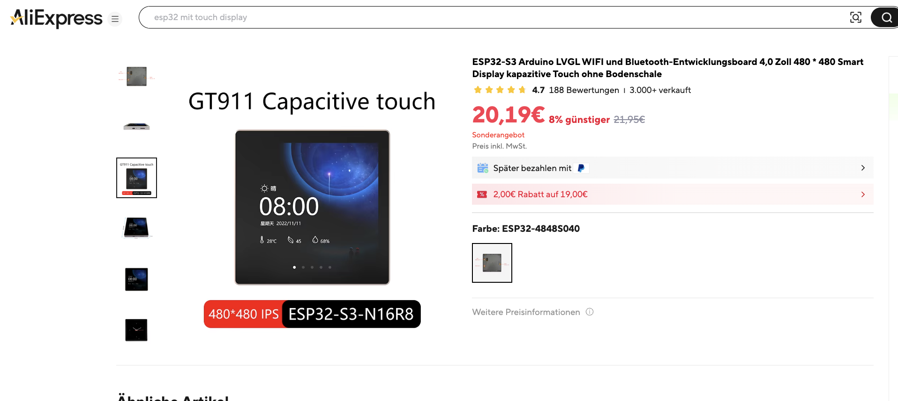

# ESP32-4848S040CI-demo



PlatformIO-Projekt für das Sunton ESP32-4848S040C Board (ESP32-4848S040CI) mit LVGL Display-Treiber basierend auf der [esp32-smartdisplay](https://github.com/rzeldent/esp32-smartdisplay) Library.

## Projektstruktur

```
smartdisplay-4848S040CI-demo/
├── boards/                # Git-Submodul mit Sunton Board-Definitionen
├── include/
│   └── lv_conf.h          # LVGL Konfigurationsdatei
├── src/
│   └── main.cpp           # Hauptprogramm
├── pre_build.py           # Pre-Build-Script (entfernt ARM-Assembly)
├── platformio.ini         # PlatformIO Projektkonfiguration
└── README.md
```

## Was aus der smartdisplay README übernommen wurde

Die Schritte orientieren sich an der Anleitung im übergeordneten [esp32-smartdisplay README](../README.md):


### Step 2 — Board-Definitionen als Git-Submodul (wie beschrieben im ESP32-4848S040CI README)

```bash
git init
git submodule add https://github.com/rzeldent/platformio-espressif32-sunton.git boards
```

Direkt aus der README übernommen. Die Board-JSON-Dateien (hier `esp32-4848S040CIY1.json`) liegen im `boards/`-Ordner und werden von PlatformIO automatisch erkannt.

### Step 3 — Projekt mit Platzhalter-Board erstellt (wie beschrieben im ESP32-4848S040CI README)

```bash
pio project init --board esp32dev
```

Wie in der README empfohlen: ein bekanntes ESP32-Board als Platzhalter verwenden und danach in der `platformio.ini` auf `esp32-4848S040CIY1` ändern.

### Step 4 — Library als Dependency hinzugefügt (wie beschrieben im ESP32-4848S040CI README)

```ini
lib_deps =
    https://github.com/rzeldent/esp32-smartdisplay.git
```

Direkt aus der README übernommen — bindet die Library und LVGL automatisch als Dependency ein.

### Step 5 — lv_conf.h erstellt (wie beschrieben im ESP32-4848S040CI README)

Die README empfiehlt, die Datei `lv_conf_template.h` aus der LVGL-Library nach `include/` zu kopieren und umzubenennen. Die wichtigen Einstellungen aus der README wurden übernommen:

- `LV_COLOR_DEPTH 16` — nur RGB565 wird auf diesen Panels unterstützt (wie in der README angegeben)
- `#if 1` statt `#if 0` am Anfang — aktiviert die Datei (wie in der README beschrieben)
- `LV_USE_PERF_MONITOR 1` — zum Debugging, wie in der README empfohlen

### Step 6 — Build-Flags übernommen (wie beschrieben im ESP32-4848S040CI README)

Die Build-Flags wurden aus der README übernommen:

```ini
build_flags =
    -Ofast
    -Wall
    '-D BOARD_NAME="${this.board}"'
    '-D CORE_DEBUG_LEVEL=ARDUHAL_LOG_LEVEL_INFO'
    -D LV_CONF_PATH=${platformio.include_dir}/lv_conf.h
```

Ebenso `monitor_speed`, `monitor_rts`, `monitor_dtr`, `monitor_filters` und `board_build.partitions` aus dem Appendix-Template der README.

### Step 7 — Display-Initialisierung in main.cpp (wie beschrieben im ESP32-4848S040CI README)

Der Code in `main.cpp` folgt 1:1 dem Beispiel aus der README:

- `smartdisplay_init()` im `setup()`
- `lv_tick_inc()` + `lv_timer_handler()` im `loop()`

Zusätzlich wurde ein einfaches Label hinzugefügt um zu prüfen, ob das Display funktioniert.

## Was NICHT direkt aus der README übernommen werden konnte

Folgende Anpassungen waren nötig, die über die README-Anleitung hinausgehen:

### Platform-Version pinnen

Die README gibt `platform = espressif32` ohne Version an. Die aktuellste Version (55.x pioarduino mit ESP-IDF 5.5+) ist jedoch inkompatibel mit der esp32-smartdisplay Library — die ESP-IDF API hat `disp_off` zu `disp_on_off` umbenannt.

**Lösung**: Platform auf `espressif32 @ 6.9.0` gepinnt.

### LVGL-Version explizit pinnen

Die Library definiert `lvgl/lvgl @ ^9.2.2` als Dependency. Das `^` erlaubt PlatformIO aber, automatisch auf 9.5.0 zu aktualisieren, was ARM-spezifische Assembly-Dateien enthält.

**Lösung**: LVGL explizit als `lvgl/lvgl @ 9.2.2` in `lib_deps` hinzugefügt.

### Pre-Build-Script für ARM-Assembly

Auch LVGL 9.2.2 enthält ARM-spezifische Assembly-Dateien (Helium `.S` und NEON `.S`), die der Xtensa-Assembler (ESP32-S3) nicht verarbeiten kann. Das wird in der README nicht erwähnt.

**Lösung**: `pre_build.py` entfernt diese Dateien automatisch vor jedem Build:
- `lvgl/src/draw/sw/blend/helium/lv_blend_helium.S`
- `lvgl/src/draw/sw/blend/neon/lv_blend_neon.S`

### LV_CONF_PATH Quoting

Die README zeigt die Syntax `'-D LV_CONF_PATH=${platformio.include_dir}/lv_conf.h'`. Bei LVGL 9.2.x funktioniert das aber nur **ohne** zusätzliche Anführungszeichen um den Pfad, da das `__LV_TO_STR`-Macro den Wert selbst stringifiziert. Mit Quotes bekommt man `#include expects "FILENAME"` Fehler.

## Bekannte Probleme / Fallstricke

| Problem | Ursache | Lösung |
|---------|---------|--------|
| `#include expects "FILENAME"` bei LV_CONF_PATH | Falsche Anführungszeichen im `-D` Flag | Keine Quotes um den Pfad verwenden |
| `disp_off` has no member / `disp_on_off` | Zu neue ESP-IDF Version (5.5+) | Platform auf `espressif32 @ 6.9.0` pinnen |
| `unknown opcode 'typedef'` bei `.S`-Dateien | ARM-Assembly wird mit Xtensa-Assembler kompiliert | Pre-Build-Script entfernt die `.S`-Dateien |
| LVGL 9.5.0 wird automatisch gezogen | `^9.2.2` Dependency erlaubt Minor-Upgrades | LVGL explizit auf `9.2.2` pinnen in `lib_deps` |
| Änderungen an lv_conf.h wirken nicht | Library-Cache in `.pio/` | `.pio/`-Ordner löschen und neu bauen |
| Pfad zu `lv_conf.h` wird falsch aufgelöst | `ESP32` ist ein Preprocessor-Macro (`#define ESP32 1`) — Ordnernamen mit `ESP32` werden vom Compiler verstümmelt | Projektordner darf nicht `ESP32` im Namen haben (daher `smartdisplay-...` statt `ESP32-...`) |

## Build & Flash

```bash
pio run                    # Kompilieren
pio run --target upload    # Auf das Board flashen
pio device monitor         # Serielle Ausgabe anzeigen
```

### Weitere nützliche PlatformIO-Befehle

```bash
# Build + Upload + Monitor in einem Schritt
pio run --target upload && pio device monitor

# Clean Build (z.B. nach Änderungen an lv_conf.h)
rm -rf .pio && pio run

# Filesystem (SPIFFS/LittleFS) hochladen
pio run --target uploadfs

# Board-Info anzeigen
pio boards | grep 4848

# Installierte Libraries anzeigen
pio pkg list
```

### Backup-Firmware wiederherstellen

```bash
~/.platformio/penv/bin/python ~/.platformio/packages/tool-esptoolpy/esptool.py \
    --chip esp32s3 --port /dev/cu.usbserial-10 \
    write_flash 0x0 backup-initial-demo/firmware_full_16MB.bin
```

Siehe auch [backup-initial-demo/README.md](backup-initial-demo/README.md) für Details.

## Speicherverbrauch

```
RAM:   [==        ]  21.1% (69 KB / 328 KB)
Flash: [===       ]  27.2% (535 KB / 1966 KB)
```
